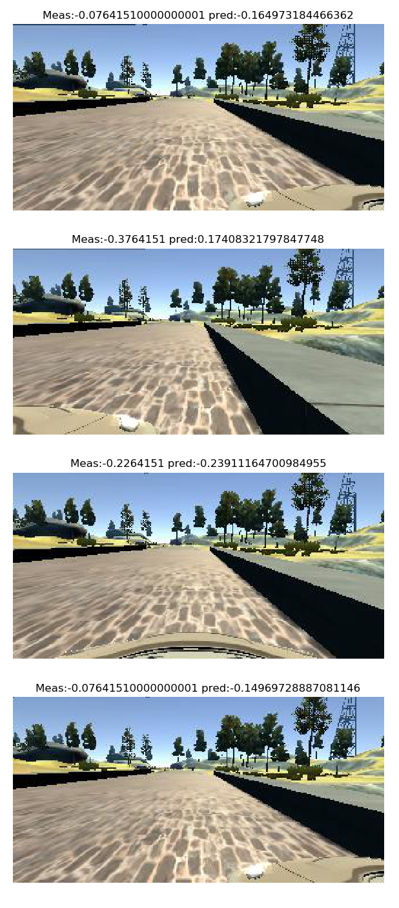

# **Behavioral Cloning** 

## Writeup Template

### You can use this file as a template for your writeup if you want to submit it as a markdown file, but feel free to use some other method and submit a pdf if you prefer.

---

**Behavioral Cloning Project**

The goals / steps of this project are the following:
* Use the simulator to collect data of good driving behavior
* Build, a convolution neural network in Keras that predicts steering angles from images
* Train and validate the model with a training and validation set
* Test that the model successfully drives around track one without leaving the road
* Summarize the results with a written report

## Rubric Points
### Here I will consider the [rubric points](https://review.udacity.com/#!/rubrics/432/view) individually and describe how I addressed each point in my implementation.  

---
### Files Submitted & Code Quality

#### 1. Submission includes all required files and can be used to run the simulator in autonomous mode

My project includes the following files:
* behaviour_cloning.py containing the script to create and train the model
* drive.py for driving the car in autonomous mode
* model.h5 containing a trained convolution neural network for driving on track 1
* writeup_report.md summarizing the results
* Track1Drive1.mp4 video recording of vehicle driving around track 1
* jungleDrive1.mp4 video recording of vehicle driving around jungle track

#### 2. Submission includes functional code
Using the Udacity provided simulator and my drive.py file, the car can be driven autonomously around track 1 and 2 by executing 
```sh
python drive.py model.h5
```

#### 3. Submission code is usable and readable

The behaviour_cloning.py file contains the code for training and saving the convolution neural network. The file shows the pipeline 
I used for training and validating the model, and it contains comments to explain how the code works.

### Model Architecture and Training Strategy

#### 1. An appropriate model architecture has been employed

I adopted my neural network structure from nvidia's end to end learning paper. 
(https://images.nvidia.com/content/tegra/automotive/images/2016/solutions/pdf/end-to-end-dl-using-px.pdf)


My model consists of three convolution neural network with 5x5 filter sizes and depths between 24 and 64 (behaviour_cloning.py lines 147-162) 

The model includes ELU layers to introduce nonlinearity (code line 151), and the data is normalized in the model using a 
Keras lambda layer (code line 18).


| Layer (type)               | Output Shape        | Param #  |
|----------------------------|---------------------|----------|
| cropping2d_1 (Cropping2D)  | (None, 115, 320, 3) | 0        |
| conv2d_1 (Conv2D)          | (None, 56, 158, 24) | 1824     |
| conv2d_2 (Conv2D)   | (None, 26, 77, 36)  | 21636    |
| conv2d_3 (Conv2D)   | (None, 11, 37, 48)  | 43248    |
| conv2d_4 (Conv2D)   | (None, 9, 35, 64)   | 27712    |
| conv2d_5 (Conv2D)   | (None, 7, 33, 64)   | 36928    |
| dropout_1 (Dropout) | (None, 7, 33, 64)   | 0        |
| flatten_1 (Flatten) | (None, 14784)       | 0        |
| dense_1 (Dense)     | (None, 1164)        | 17209740 |
| dense_2 (Dense)     | (None, 100)         | 116500   |
| dense_3 (Dense)     | (None, 50)          | 5050     |
| dense_4 (Dense)     | (None, 10)          | 510      |
| dense_5 (Dense)            | (None, 1)           | 11       |

Total params: 17,463,159 <br/>
Trainable params: 17,463,159 <br/>
Non-trainable params: 0 <br/>

#### 2. Attempts to reduce overfitting in the model

The model contains dropout layers in order to reduce overfitting (behaviour_cloning.py lines 156). To augment and generalize the network
images were flipped and steering angles were flipped and fed in as training data. The data was also shuffled and fed into the training data generator.

The model was trained and validated on different data sets to ensure that the model was not overfitting (code line 202).
The model was tested by running it through the simulator and ensuring that the vehicle could stay on the track.

#### 3. Model parameter tuning

The model used an adam optimizer, and the learning rate was set to 0.0005 and was trained for around 3 epochs (behaviour_cloning.py line 165).

#### 4. Appropriate training data

Training data was chosen to keep the vehicle driving on the road. I used around 2 to 3 laps of center lane driving, and
 chose few problematic spots for recovery training.   

For details about how I created the training data, see the next section. 

### Model Architecture and Training Strategy

#### 1. Solution Design Approach

As mentioned above I used nvidia's end to end learning architecture. To avoid overfitting I fed around 50000 images to avoid overfitting.

I did a sanity check of the model by showing the trained model several images and recording the predictions from the model.

 

At each stage I ran the model with the simulator to see how well it performed.
There were a few spots where the vehicle fell off the track. The dirt side from track 1 and steep cliff with a view of a road below was causing the car to drive off the road.
 To improve the driving behavior in these cases, I fed several set of images showing the recovery away from side road and red markings on the side of the road.

At the end of the process, the vehicle is able to drive autonomously around the track without leaving the road.

#### 2. Final Model Architecture

The final model architecture (behaviour_cloning.py lines 18-24) consisted of a convolution neural network with the following layers and layer sizes ...

Computational graph used for the neural network forward pass is shown below: 

 

#### 3. Creation of the Training Set & Training Process

To capture good driving behavior, I first recorded two laps on track one using center lane driving. Here is an example image of center lane driving:


I then recorded the vehicle recovering from the left side and right sides of the road back to center.

The problematic spots are shown below:
 

  

To augment the data sat, I also flipped images and angles thinking that this generalize the model and avoid overfitting. For example, here is an image that has then been flipped along with the measurements and predicition:


After the collection process, I had around 175000 number of data points. I then preprocessed this data by clipping 30 pixels from the top of the image since the sky and tree tops did not have any useful information for the neural network .
I also clipped 15 pixels from the bottom of the image to remove the hood of the car from the image input.


I finally randomly shuffled the data set and put 10% of the data into a validation set. 

I used this training data for training the model. The validation set helped determine if the model was over or under fitting. 

The ideal number of epochs was around 3 to 4 before the training and validation losses started levelling off. 
